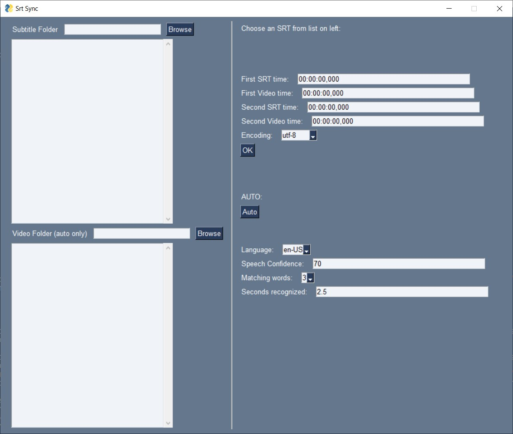
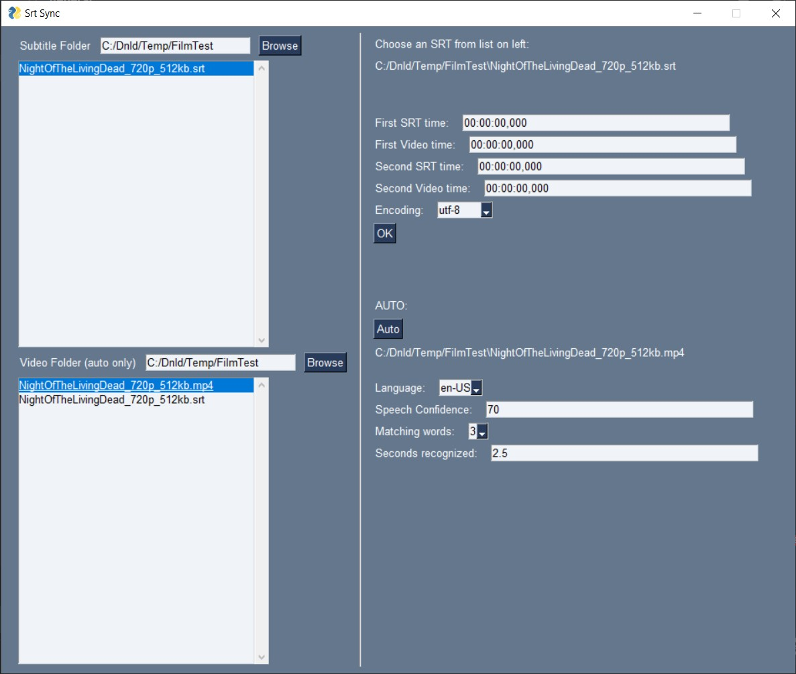
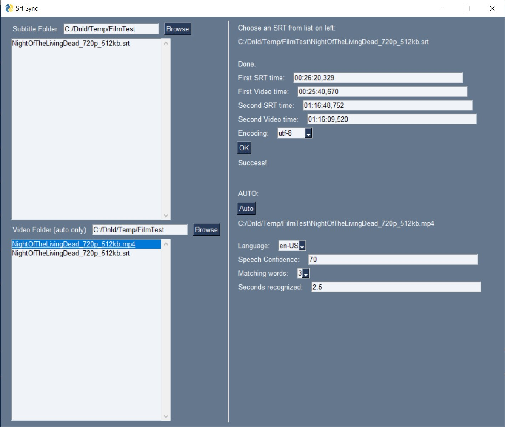
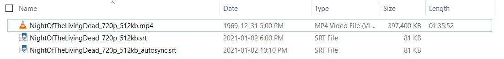

# AutoSrtSyncGUI

A Python program with a GUI to automatically sync subtitles with the wrong framerate by comparing speech in the movie to text in the subtitles. If your SRT subtitles keep getting out of sync with audio/video (a single shift doesn't work for long), this is the tool for you.

This will sync SRT subtitles automatically using Google speech recognition.
Takes some time (really depends on the video, can be from seconds to minutes), but you don't need to find the subtitle and movie times yourself making it much more convenient.

Works pretty reliably for English movies, and I've tested it on some French movies as well.
NOTE: only works for subtitles that are in the same language as the video right now

This program will not work if the video has a commercial that subtitles don't. It uses two points to do a linear sync for a difference in framerate and/or start time between the subtitles and video (the most common problems I come across)

Most important libraries used:
- srt/srt_tools for parsing .srt subtitle files
- speech_recognition for interface with Google speech recognition API
- moviepy for cutting short audio clips from a video

HOW TO USE:
- Pip install dependencies (srt, PySimpleGUI, speech_recognition, srt_tools, moviepy)
- Run program
- Select SRT file and the video you want to sync it to
- Choose settings (encoding, auto sync options)
- Press Auto and wait until complete

If you get an encoding error, try another encoding from the dropdown and press OK.
You can also edit the generated times manually and press OK to resync.

TODO:
- ~~Add an option to choose how much confidence is needed in the speech recognition (currently 70%)~~
- ~~Add an option to choose the minimum number of words needed to match (currently 3 words)~~
- ~~Add an option to choose how many seconds of speech to recognize with (currently 2.5 seconds)~~
- Add an option to allow near matches
- Add GIFs of video with unsynced vs synced subs to README

Images:

**Initial GUI** 
 
**Files Selected** 
 
**Sync Completed** 
 
**Files Created** 
